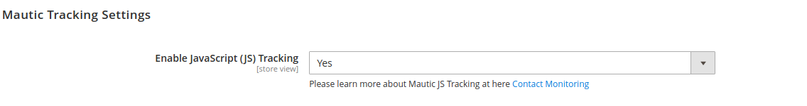

# Magento 2 Mautic Integration

[Mautic (opens new window)](https://www.mautic.org/) is an open-source marketing automation software that helps online businesses automate their repetitive marketing tasks such as lead generation, contact scoring, contact segmentation, and marketing campaigns.


* Compatible Magento Version: 2.3.7, 2.4.0, 2.4.1, 2.4.2, 2.4.3 - latest
* Compatible Mautic Version: 2.16, 3.0, 3.1, 3.2, 3.4, 4.0, 4.0.2 - latest

## Main Features

- Contact
    + Create a new contact
    + Delete a contact
    + Get data of a contact
    + Get data of all contacts
    + Update a contact

- Company
    + Create a new company
    + Delete a company
    + Get data of a company
    + Get data of all companies
    + Update a company

- Campaign Contact (Comming soon)
    + Add contact to a campaign
    + Remove contact from a campaign

- Company Contact (Comming soon)
    + Add contact to a company
    + Remove a contact from a company

- Contact Segment (Comming soon)
    + Add contact to a segment
    + Remove contact from a segment

- Mapping Mautic Custom Fiels to Magento 2 Customer Attributes
- Sync contacts data from Customers
- Sync contacts data from Orders
- Sync contacts data from Reviews
- Sync contacts data from Subscribers
- Manage Companies and sync to Mautic
- Auto remove contact when admin delete Guest Subscriber in Magento Backend
- Allow send newsletter subscription email via Mautic (disable send email from magento 2)
- Tracking visitor page view - logged in customer
- Support Cron jobs for contacts exporting: export customers, export orders, export reviews, export subscribers
- Support trigger events after save to sync data to Mautic
- Support Console commands for Sync processing: Export customers, Export Orders, Export Reviews, Export Subscribers
- Asynchronous Data Export: Support queue and cron job for calling Mautic APIs 
- Includes abandon card tags
- Review reminder tags (Comming Soon)

## Installation
\* = in production please use the `--keep-generated` option

### Type 1: Zip file

 - Unzip the zip file in `app/code/Lof`
 - Run command setup lib via composer `composer require mautic/api-library`
 - Enable the module by running `php bin/magento module:enable Lof_Mautic`
 - Apply database updates by running `php bin/magento setup:upgrade`\*
 - Re deploy static files by running `php bin/magento setup:static-content:deploy -f`\*
 - Flush the cache by running `php bin/magento cache:flush`

### Type 2: Composer

 - Make the module available in a composer repository for example:
    - private repository `repo.magento.com`
    - public repository `packagist.org`
    - public github repository as vcs
 - Add the composer repository to the configuration by running `composer config repositories.repo.magento.com composer https://repo.magento.com/`
 - Install the module composer by running `composer require landofcoder/module-mautic-integration`
 - enable the module by running `php bin/magento module:enable Lof_Mautic`
 - apply database updates by running `php bin/magento setup:upgrade`\*
 - Re deploy static files by running `php bin/magento setup:static-content:deploy -f`\*
 - Flush the cache by running `php bin/magento cache:flush`


## Configuration

- Log in to Admin, Then go to **STORES > Configurations > Landofcoder > Mautic Integration Settings**.


## Screenshots

- Customer Contacts:


- Mapping Fields:


- Mautic Tracking Settings:



- Newsletter Settings:


- Company Information:


- Async API Queues in RabbitMQ:


Require setup and config RabbitMQ for Magento 2 [RabbitMQ Configrable Guide](https://blog.landofcoder.com/how-to-set-up-and-configure-rabbitmq-with-magento-2/)

The module support there consummers:

```
mautic_customer_save
mautic_order_create
mautic_review_save
mautic_subscriber_save
```

## Compatible Modules

- [Magento 2 GDPR Compatible](https://github.com/landofcoder/module-magento2-mautic-gdpr)
- Magento 2 Formbuilder Mautic Compatible
- Magento 2 B2B Company Account Mautic Compatible
- Magento 2 Multi-Vendor Marketplace Mautic Compatible

## Donation

If this project help you reduce time to develop, you can give me a cup of coffee :) 

[](https://www.paypal.com/paypalme/allorderdesk)


**Our Magento 2 Extensions List**
* [Megamenu for Magento 2](https://landofcoder.com/magento-2-mega-menu-pro.html/)

* [Page Builder for Magento 2](https://landofcoder.com/magento-2-page-builder.html/)

* [Magento 2 Marketplace - Multi Vendor Extension](https://landofcoder.com/magento-2-marketplace-extension.html/)

* [Magento 2 Multi Vendor Mobile App Builder](https://landofcoder.com/magento-2-multi-vendor-mobile-app.html/)

* [Magento 2 Form Builder](https://landofcoder.com/magento-2-form-builder.html/)

* [Magento 2 Reward Points](https://landofcoder.com/magento-2-reward-points.html/)

* [Magento 2 Flash Sales - Private Sales](https://landofcoder.com/magento-2-flash-sale.html)

* [Magento 2 B2B Packages](https://landofcoder.com/magento-2-b2b-extension-package.html)

* [Magento 2 One Step Checkout](https://landofcoder.com/magento-2-one-step-checkout.html/)

* [Magento 2 Customer Membership](https://landofcoder.com/magento-2-membership-extension.html/)

* [Magento 2 Checkout Success Page](https://landofcoder.com/magento-2-checkout-success-page.html/)


**Featured Magento Services**

* [Customization Service](https://landofcoder.com/magento-2-create-online-store/)

* [Magento 2 Support Ticket Service](https://landofcoder.com/magento-support-ticket.html/)

* [Magento 2 Multi Vendor Development](https://landofcoder.com/magento-2-create-marketplace/)

* [Magento Website Maintenance Service](https://landofcoder.com/magento-2-customization-service/)

* [Magento Professional Installation Service](https://landofcoder.com/magento-2-installation-service.html)

* [Customization Service](https://landofcoder.com/magento-customization-service.html)
